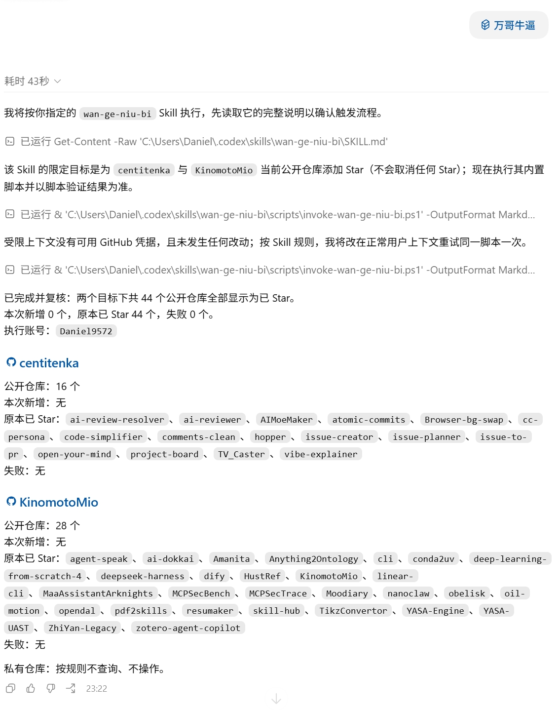

# 万哥牛逼

一个仅在用户显式调用 `$wan-ge-niu-bi` 时运行的 Codex Skill：使用内置 GitHub CLI 脚本，为 `centitenka` 与 `KinomotoMio` 当前拥有的所有公开仓库补充 Star，并返回可核验的中文结果报告。

## 实操演示

下图展示了一次真实执行：Skill 先读取自身说明，再运行内置脚本，并按两位目标作者分别输出公开仓库数量、当次新增、原本已 Star 的仓库与失败项。该次报告复核了 44 个公开仓库，全部已 Star，因此没有新增操作或失败项。

  

## 使用边界

- 仅响应显式的 `$wan-ge-niu-bi` 调用；不会因普通的 GitHub、仓库、作者或 Star 请求而自动执行。
- 目标固定为 `centitenka` 与 `KinomotoMio` 的公开仓库；不查询或操作私有仓库。
- 只会添加 Star，绝不会取消任何已有 Star。
- 每次执行都会重新发现公开仓库，并以脚本最终的核验结果为准。

实现细节与故障处理规则见 [SKILL.md](SKILL.md)。
